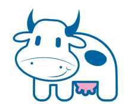
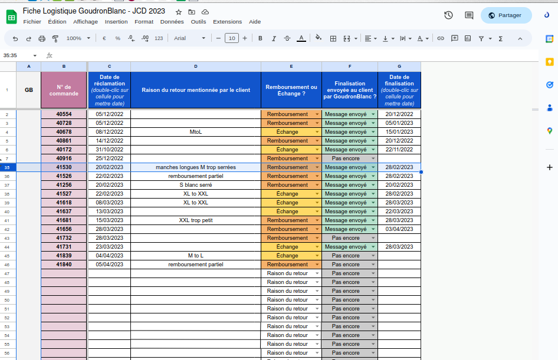
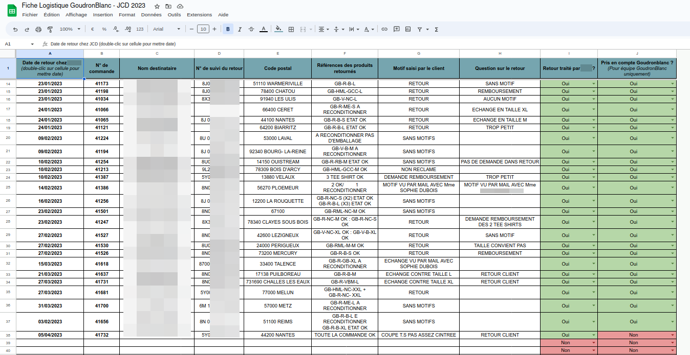
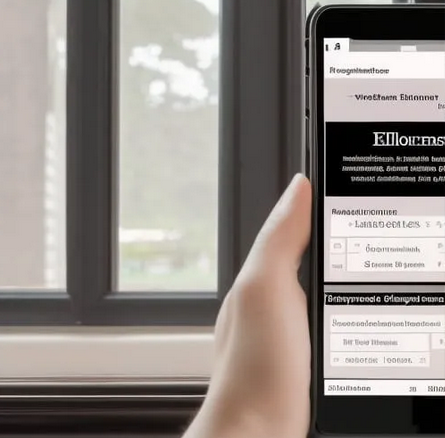
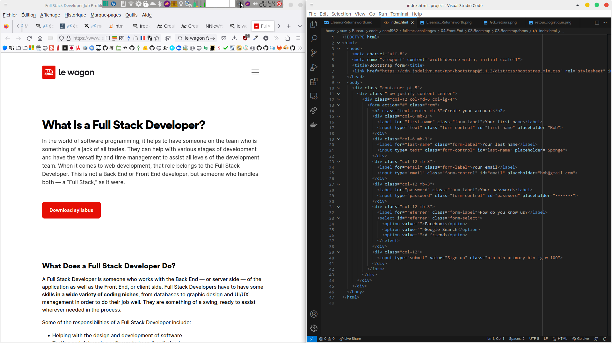

<!-- _backgroundColor: snow -->

# Gestion des retours e-commerce

- Application web pour gérer les retours de produits
- Alignement avec le contenu de la formationb Le Wagon
- Utilisation de Ruby on Rails, HTML, CSS, SQL, JS, MVC, CRUD...

---
Problématique
---
<!-- _backgroundColor: snow -->
# Points douloureux

- Existant fastidieux à base de Sheets ou d'Excel  

- Coordination avec le personnel de l'entrepôt
- Gestion de la communication avec les clients

---
Solution
---
<!-- _backgroundColor: snow -->
# L'Application de gestion des retours "Eleanor Returnsworth"

- Gestion complète du processus de retour
- Communication facilitée entre les équipes
- Interface conviviale

---
Originalité
---
<!-- _backgroundColor: snow -->
# Caractéristiques uniques

- Utilisable par les petits logisticiens, boutiques et e-commerçants
- Utilisation de tout l'attirail full stack
- Potentiellement interfacable avec Woocommerce, Mailpoet...
