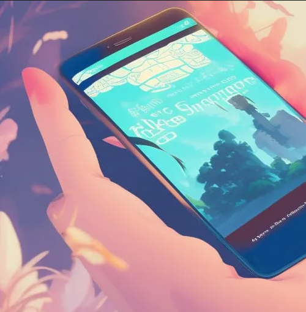

<!-- _backgroundColor: snow -->

# Gestion des retours e-commerce

- Application web pour gérer les retours de produits
- Alignement avec le contenu de la formationb Le Wagon
- Utilisation de Ruby on Rails, HTML, CSS, SQL, JS, MVC, CRUD...

---
Problématique
---
<!-- _backgroundColor: snow -->
# Points douloureux

- Existant fastidieux à base de Sheets ou d'Excel  

- Coordination avec le personnel de l'entrepôt
- Gestion de la communication avec les clients

---
Solution
---
<!-- _backgroundColor: snow -->
# L'Application de gestion des retours "Eleanor Returnsworth"

- Gestion complète du processus de retour
- Communication facilitée entre les équipes
- Interface conviviale

---
Originalité
---
<!-- _backgroundColor: snow -->
# Caractéristiques uniques

- Utilisable par les petits logisticiens, boutiques et e-commerçants
- Utilisation de tout l'attirail full stack
- Potentiellement interfacable avec Woocommerce, Mailpoet...

---
---
<!-- _backgroundColor: lightgrey -->

# **doLys Almanet Evolution**

By Le Wagon Fullstack Dev Students

---
<!-- _backgroundColor: lightgrey -->
# Target
- Tech enthusiasts, devs & digital sovereignty advocates
- Interested in open source projects, digital privacy & online freedom 

---
<!-- _backgroundColor: lightgrey -->
# Pain & Solution
- Pain: dolys.fr is outdated and has an obsolete forum format 
- Constraint: it needs preserved SEO & user base
- Solution: Responsive RoR blog, multi-author functionality, and preserving SEO & user base

---
<!-- _backgroundColor: lightgrey -->
# Originality & Coding Challenge
- Originality: RoR for rapid development, scalability, and unique hardware affiliation monetization strategy 
- Challenge: Integrating dolys.fr content into the new RoR blog, leveraging DB modeling skills

