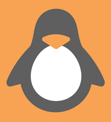
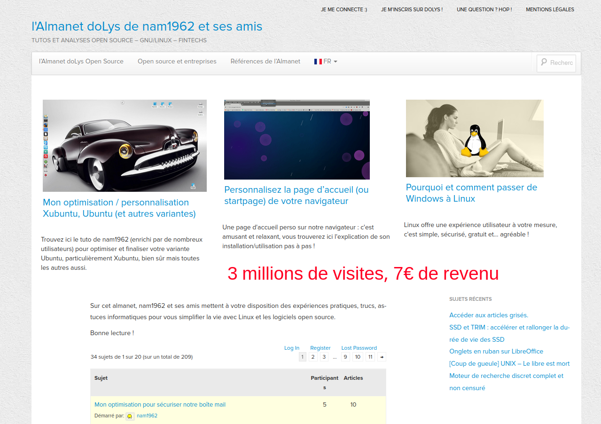
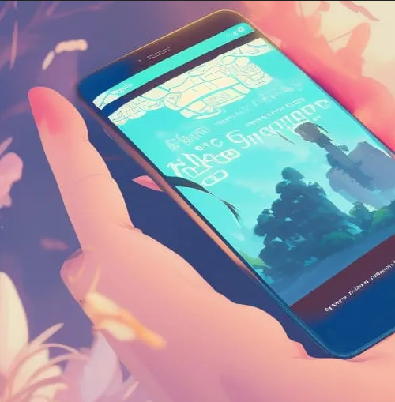

<!-- _backgroundColor: lightgrey -->

# **doLys Almanet Evolution**

By Le Wagon Fullstack Dev Students

---
<!-- _backgroundColor: lightgrey -->
# Target
- Tech enthusiasts, devs & digital sovereignty advocates
- Interested in open source projects, digital privacy & online freedom 

---
<!-- _backgroundColor: lightgrey -->
# Pain & Solution
- Pain: dolys.fr is outdated and has an obsolete forum format 
- Constraint: it needs preserved SEO & user base
- Solution: Responsive RoR blog, multi-author functionality, and preserving SEO & user base

---
<!-- _backgroundColor: lightgrey -->
# Originality & Coding Challenge
- Originality: RoR for rapid development, scalability, and unique hardware affiliation monetization strategy 
- Challenge: Integrating dolys.fr content into the new RoR blog, leveraging DB modeling skills
